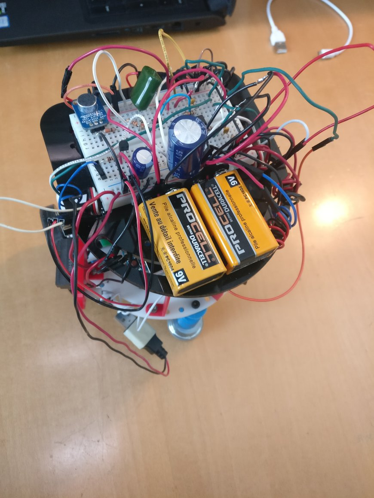
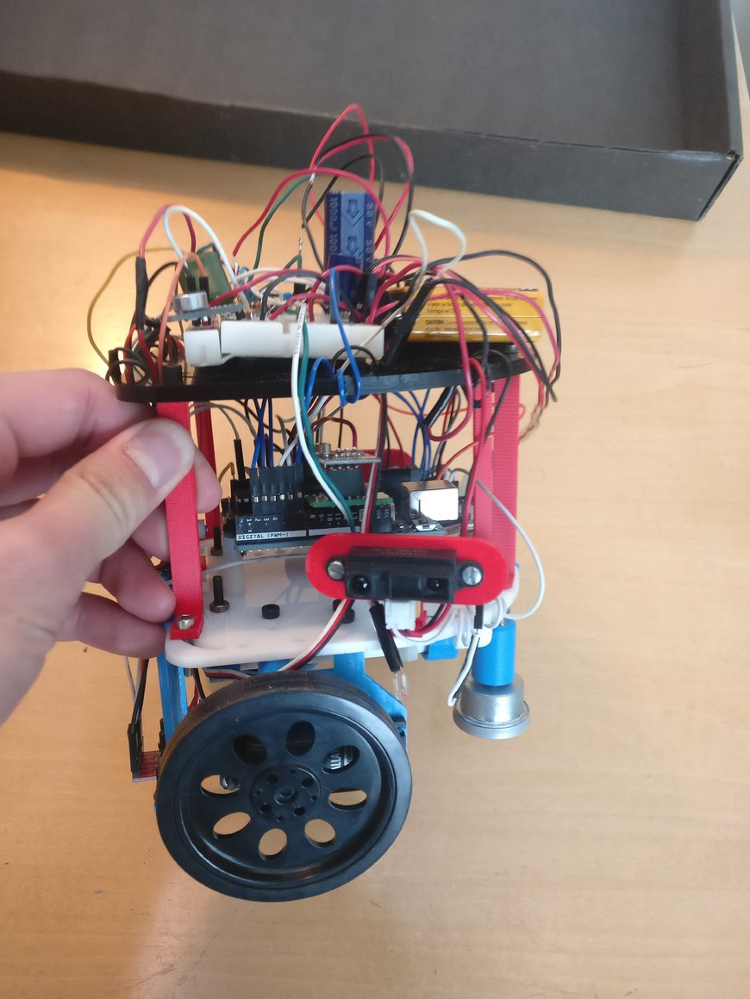
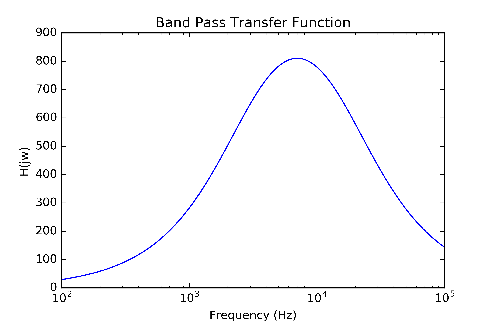

# __Final Discussion of Robot__

### Design
Here are a couple of photos of our final robot:





<!---
RUBRIC:
Good introductions and problem motivations
Clarity and thoroughness of documentation
Intuitive and nice layouts
Use of the right tools for analysis and unit testing
Presence of schematics when applicable
Presence of simulation results when applicable
Presence and evaluation of experimental results
Use of graphs and tables to display results, as well as proper axis and unit labeling
Presence of design flaws
Comparative discussion of simulation and experimental results
Presence of conclusions
Presence of suggestions for future work/improvements
You can also gain extra points by making good general tutorials for students in future semesters to use. These tutorials may for instance include ways to implement PID control, in-depth tutorials on ATmega timers, new ways to make 3D parts, etc.
-->

#### The Physical Design
We decided to stick the original design from the beginning of the class and simply build from there. We had an ordinary chassis, midsize wheels with rubber grip for better traction, a section underneath the base for the power bank, a ball bearing for stability, and we added a second layer to provide us with space to wire our circuit. We passed most of our wires through different openings in our top level chassis. We tried to keep the wires relatively organized and typically kept all ground and power wires, black and red, respectively. This helped keep the area around the actual Arduino Uno less cluttered. On the top of our robot, we also included two 9V batteries responsible for powering the rails of our robot, so that we could have a negative reference for certain circuits we included for treasure detection and possible filtering for the microphone. Our wall and treasure sensors were placed on the front, left, and right sides of the robot.

Lastly, we used three line sensors, two to keep our robot on the lines right next to each other in front of the robot, and one slightly displaced to notify us of intersections by detecting the black line.  

We ran into some interesting behavior with our treasure detectors, and realized our band-pass filter picked up the IR signals from our wall detectors, so we included a high side transistor on our IR wall sensors VCC= to shut off the wall sensors when the treasure detectors were active. Here is the design for the treasure detector detector, as well as its transfer function:


| Component | Value |
| ------------- |:-------------:|
| OA1 | LM324N |
| OA1 | LM324N  |
| R1 | 10K Ohms |
| R2 | 10K Ohms |
| R3 | 1M Ohms |
| R4 | 10K Ohms |
| R5 | 100K Ohms |
| R6 | 1K Ohms |
| C1 | 4.7 nF |
| C2 | 110 pF |

The transfer function of the amplifier looks as follows. The passband is roughly 2kHz - 20kHz.



We also created an actual base station by velcroing a breadboard, our second Arduino, and our FPGA for ease of use in transporting the base station and keeping everything together.

#### Multiplexing
One important aspect of our design was the inclusion of an 8:1 mux. Given that we were limited to the one Arduino, we ran into design constraints early on with regards to the number of analog pins available to use for all of our peripherals. Between the microphone circuit, short-range wall detectors, line detection sensors, and the treasure detection circuit, it is easy to see how quickly a team can run out of pins. To remedy this, we made use of an 8:1 mux to which we wired our three wall detectors, our treasure detection circuit output, and our microphone circuit ouput. We kept the line detection sensors on the Arduino's analog pins and also wired the mux output to one of the analog pins on the Arduino. In this way we could designate in our software when to read which mux input by digitally writing to the three mux signals. The following table shows how the mux signals correspond to the eight possible mux inputs.

| S2 | S1 | S0 | Output |
| ---- | ---- | ---- | ------ |
| LOW | LOW | LOW | Y0 |
| LOW | LOW | HIGH | Y1 |
| LOW | HIGH | LOW | Y2 |
| LOW | HIGH | HIGH | Y3 |
| HIGH | LOW | LOW | Y4 |
| HIGH | LOW | HIGH | Y5 |
| HIGH | HIGH | LOW | Y6 |
| HIGH | HIGH | HIGH | Y7 |

#### Algorithm
We used a depth-first search (DFS) algorithm to solve the maze, prioritizing path directions in the following order: forward, left, right. The core of our DFS code (with the mux integrated) is shown below.

```c++
// Global variables
node_t grid[Y_DIM][X_DIM];
node_t *visited[MAX_STACK_SIZE] = {NULL};
node_t *frontier[MAX_STACK_SIZE] = {NULL};

state_t state = PASSED_LINE;
state_dir_t dir = POSY;
int x_coord = 0;
int y_coord = -1;

void setup() {
  gridInit(); // 4 x 5 grid of unvisited nodes
}

void loop() {
  int ileft_ir = analogRead(IN_LEFT_IR); // inner left line sensor
  int iright_ir = analogRead(IN_RIGHT_IR); // inner right line sensor
  int oleft_ir = analogRead(OUT_LEFT_IR); // outer left line sensor
  digitalWrite(MUX_S2, LOW);
  digitalWrite(MUX_S1, LOW);
  digitalWrite(MUX_S0, LOW);
  int front_dist = analogRead(MUX_OUT); // front wall sensor
  digitalWrite(MUX_S2, LOW);
  digitalWrite(MUX_S1, LOW);
  digitalWrite(MUX_S0, HIGH);
  int left_dist = analogRead(MUX_OUT); // left wall sensor
  digitalWrite(MUX_S2, LOW);
  digitalWrite(MUX_S1, HIGH);
  digitalWrite(MUX_S0, LOW);
  int right_dist = analogRead(MUX_OUT); // right wall sensor
  
  // Line-following
  int maxs = map(FORWARD_SPEED, 0, 100, 90, 0);
  int delta_dir = ileft_ir - iright_ir;
  int left = (180-maxs) - delta_dir/LINE_FOLLOW_P;
  int right = (90-maxs) - delta_dir/LINE_FOLLOW_P;
  left = left > 180 ? 180 : (left < 90 ? 90 : left);
  right = right < 0 ? 0 : (right > 90 ? 90 : right); 

  switch(state) {
    case(NO_LINE): default:
      left_servo.write(left);
      right_servo.write(right);

      if(oleft_ir > LINE_THRESHOLD) state = ON_LINE;
      break;

    case(ON_LINE):
      left_servo.write(left);
      right_servo.write(right);
      
      if (oleft_ir < LINE_THRESHOLD) state = PASSED_LINE;
      break;

    case(PASSED_LINE):
      x_coord = updateXCoord(dir, x_coord);
      y_coord = updateYCoord(dir, y_coord);
      grid[y_coord][x_coord].visited = true;
      
      walls_t walls = checkWalls(front_dist, left_dist, right_dist);
      if(!walls.right_wall) {
        right_dir = (state_dir_t) ((dir + 1)%4);
        right_x = updateXCoord(right_dir, x_coord);
        right_y = updateYCoord(right_dir, y_coord);
        if(checkOpen(right_x, right_y)) pushStack(&grid[right_y][right_x], frontier);
      } if(!walls.left_wall) {
        left_dir = (state_dir_t) ((dir + 3)%4);
        left_x = updateXCoord(left_dir, x_coord);
        left_y = updateYCoord(left_dir, y_coord);
        if(checkOpen(left_x, left_y)) pushStack(&grid[left_y][left_x], frontier);
      } if(!walls.front_wall) {
        front_x = updateXCoord(dir, x_coord);
        front_y = updateYCoord(dir, y_coord);
        if(checkOpen(front_x, front_y)) pushStack(&grid[front_y][front_x], frontier);
      }

      node_t *popped_frontier = popStack(frontier);
      while(popped_frontier->visited) {
        popped_frontier = popStack(frontier);
      }
      if(popped_frontier == NULL) { // done
        stopMotors();
        while(1);
      } else {
        if(front_x == popped_frontier->x && front_y == popped_frontier->y) {
          pushStack(&grid[y_coord][x_coord], visited);
        } else if(left_x == popped_frontier->x && left_y == popped_frontier->y) {
          pushStack(&grid[y_coord][x_coord], visited);
          turnLeft();
        } else if(right_x == popped_frontier->x && right_y == popped_frontier->y) {
          pushStack(&grid[y_coord][x_coord], visited);
          turnRight();
        } else {
          pushStack(popped_frontier, frontier);
          node_t *popped_visited = popStack(visited);
          left_dir = (state_dir_t) ((dir + 3)%4);
          left_x = updateXCoord(left_dir, x_coord);
          left_y = updateYCoord(left_dir, y_coord);
          right_dir = (state_dir_t) ((dir + 1)%4);
          right_x = updateXCoord(right_dir, x_coord);
          right_y = updateYCoord(right_dir, y_coord);
          state_dir_t back_dir = (state_dir_t) ((dir + 2)%4);
          int back_x = updateXCoord(back_dir, x_coord);
          int back_y = updateYCoord(back_dir, y_coord);
          if(left_x == popped_visited->x && left_y == popped_visited->y) turnLeft();
          if(right_x == popped_visited->x && right_y == popped_visited->y) turnRight();
          if(back_x == popped_visited->x && back_y == popped_visited->y) reverse();
        }
      } state = NO_LINE;
      break;
  }
}
```

We also implemented several helper functions with our algorithm:

```c++
// Stack helper functions
bool pushStack(node_t *n, node_t **stack) {
  for (uint8_t i = 0; i < MAX_STACK_SIZE; i++) {
    if (!stack[i]) {
      stack[i] = n;
      return true;
    }
  } return false;
}

node_t *popStack(node_t **stack) {
  node_t *prev = stack[0];
  for (uint8_t i = 1; i < MAX_STACK_SIZE; i++) {
    if (!stack[i]) {
      stack[i-1] = NULL;
      return prev;
    }
    prev = stack[i];
  } return prev;
}

// Helper functions to update position and orientation
int updateXCoord(state_dir_t dir, int x) {
  switch(dir) {
    case(NEGX): default:
      return (x-1);
      break;
    case(POSX):
      return (x+1);
      break;
    case(NEGY):
      return x;
      break;
    case(POSY):
      return x;
      break;
  }
}

int updateYCoord(state_dir_t dir, int y) {
  switch(dir) {
    case(NEGX): default:
      return y;
      break;
    case(POSX):
      return y;
      break;
    case(NEGY):
      return (y-1);
      break;
    case(POSY):
      return (y+1);
      break;
  }
}

state_dir_t updateDir(state_dir_t dir, int lfr) { // lfr: 0 = left, 1 = front, 2 = right
  switch(dir) {
    case(NEGX): default:
      if(lfr == 2) return NEGY;
      else if(!lfr) return POSY;
      break;
    case(POSX):
      if(lfr == 2) return POSY;
      else if(!lfr) return NEGY;
      break;
    case(NEGY):
      if(lfr == 2) return POSX;
      else if(!lfr) return NEGX;
      break;
    case(POSY):
      if(lfr == 2) return NEGX;
      else if(!lfr) return POSX;
      break;
  }
}

// Helper functions to check walls
walls_t checkWalls(int front_dist, int left_dist, int right_dist) {
  walls_t walls;
  if(front_dist > WALL_THRESHOLD) walls.front_wall = 1;
  else walls.front_wall = 0;
  if(left_dist > WALL_THRESHOLD) walls.left_wall = 1;
  else walls.left_wall = 0;
  if(right_dist > WALL_THRESHOLD) walls.right_wall = 1;
  else walls.right_wall = 0;
  return walls;
}

bool checkOpen(int x, int y) {
  if(x < 0 or x > 4 or y < 0 or y > 3) return false;
  if(grid[y][x].visited) return false;
  return true;
}
```

#### Display
At each intersection, the robot would transmit via the radio information about the surrounding walls, treasures, and the robot's location at that node. At the base station, this information was parsed and put together in our display. A green dot means that the node has been visited, a red line is a wall, and the treasures were designated at the nodes by yellow circles with the corresponding number in kHz for the frequencies, 7, 12 and 17 (in the colors red, green and blue respectively). Here is a [video demo of our display](https://www.youtube.com/watch?v=_FmDJLEa9xo) (Note: this one does not have the treasure detection).

#### Simulation vs. Experimental Results
It is important to note the discrepancies in results between the individual circuits when they stood alone in separate labs compared to when they were integrated into a greater system. Standalone, functionality of circuits such as the treasure detection and VGA communication are easy to verify. Simulating the data we would be transmitting in the competition allows us to hold a number of factors constant, and lets us check the logic in our high level design with greater accuracy. In reality, the various subsystems are relatively interdependent, to the point that holding factors constant for simulation purposes fails to account for the degree to which a particular circuit affects the code to handle other circuits. For example, it is difficult to simulate wall detection without factoring in the sensitivity of our ir sensors to treasures in the maze. While we investigated how each of these circuits behaved in labs 1-4, and simulated competition environments, we could not accurately predict the behavior of the entire system without physically experimenting with different threshold values and seeing how that affected the robot’s ability to traverse the maze.

#### Potential Flaws in Design
Nearly all of the connections and circuits were placed on the very top of the robot, which meant that the wires had to go all the way from near the bottom where the sensors and Arduino Uno were, creating a lot of confusion when it came to debugging. Since we used a circuit board instead of a PCB, we were able to edit our circuits as often as we pleased, but that also meant wires came loose somewhat often and significant time was lost to tracing back these kinds of problems.

### Competition
Unfortunately for us, our robot did not work the way we planned during the competition. We noticed weird behavior when testing in the mazes in the Duffield atrium, which lead to some rapid debugging and quick fixes, and afterward noticing that a wire had come loose, so the changes we made served to mess up how the robot made its detections completely.

When it actually came to our first run, our robot drove two squares, then the power bank decided to die and we were unable to try again until the next round. The video below is from our second attempt (after charging the power bank after the first attempt and some quick fixes), where you see a false detection from our front wall sensor. Assuming there would have been a wall there, the depth-first search did work properly, and our display signaled done and our tone did play. We tried running the robot again, and it continued to keep having false wall detections, and again we were unable to complete the maze. After our final imperfect round, we realized one of the two ground wires from the Arduino to the breadboard's GND rail had come loose, causing the breadboards GND to be at a slightly high voltage than our Arduino's GND. Unfortunately, this was enough to cause `analogRead()` on the front wall sensor to be slightly higher than we were expecting it to be, and as a result our threshold detector kept falsely detecting walls.  

The treasure detectors were perhaps a bit too sensitive and had many false detections, but the one genuine treasure that it did pass it did pick up, as reflected in our display. Similar to why the treasure detectors, the microphone circuit which used nearly the same code, did not pick up the start tone.

[Here](https://www.youtube.com/watch?v=oZpQe9s_qdU) is the video of our robot during the final competition.

While we were all disappointed in our performance in the competition, we did take a [video](https://www.youtube.com/edit?o=U&video_id=NwgnMxAbo9s) the night before, showing our robot and display working correctly.

#### Suggestions for Future Improvements
* Solder working circuit, so there will be no chances of wires popping out. This can save a lot of time when testing.
* Use different layered boards so that wires wouldn't be blocking the Arduino when we needed to access it.
* Larger wheels to improve speed.

#### Cost
The total cost of our robot was $63, coming in at $37 below the budget. The cost came from our line sensors, distance sensors, microphone (with gain), and servos. All other components of the robot were spare parts found in the lab (e.g. Arduino Unos, FPGA, wires, resistors, capacitors, etc.) at no additional cost to us.

### Conclusions
It was hard to test in different environments because background sound and light always affect thresholds whereas in simulations those things can be held constant. Our robot and seemed to be working fine during all testing leading up to the final competition. Loose wires were the main cause for the poor showing in the competition, which was compounded with other small errors.

In the end, it was a fun, albeit stressful semester which gave all of us experience actually implementing many different ECE concepts we have learned in other classes, as well as experience working in a team, and many opportunities to make mistakes and learn from them. We all gained an appreciation for the development process for complicated intelligent physical systems, from using effective communication to complete the the many smaller goals needed in order to get to our final robot.
