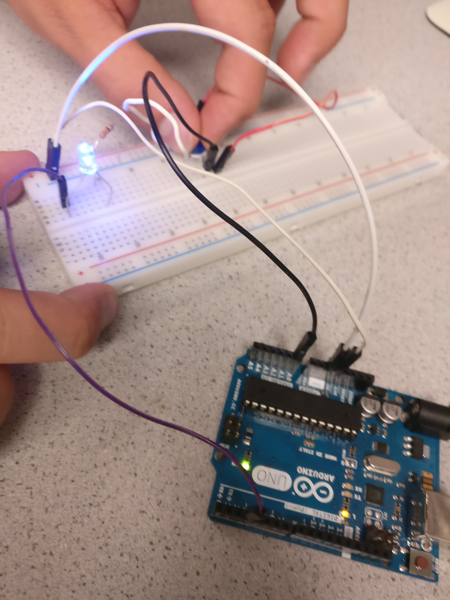
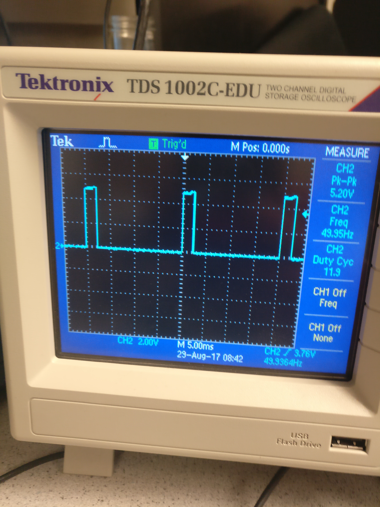

# __*Lab 1*__

### Objective
Our objective, for this lab, was to get an introduction to using the Arduino Uno and the Arduino IDE by creating a couple basic programs that performed simple functions. We were also tasked with assembling our robot and having it perform a simple autonomous task.

### Work Distribution
We split into two teams. One team was compromised of Kelsey, Rajiv, and Christina, while the other was made up of Aaron, Adam, and David. The second team was primarily responsible for the video and picture documentation of this lab. The entire group worked on the construction of the robot.

### Helpful links
[Arduino Reference](https://www.arduino.cc/en/Reference/HomePage)
[Potentiometer Data Sheet](http://www.bourns.com/data/global/pdfs/3306.pdf)

### Lab Documentation
1. We collected all the materials needed for the the lab(listed below)

   * Arduino Uno
   * USB A/B cable
   * Continuous rotation servos
   * Pushbutton
   * LED (any color except IR!)
   * Potentiometer
   * Several resistors (kΩ range)
   * Solderless breadboard
2. We installed the Arduino IDE on our laptops (the program can also be used on the lab computers where it is already installed)
3. Next, we located the blink sketch and ran it with the board. (File > Examples > 1.Basics > Blink)
   * Note: When running blink sketch with board, the LED that flashes is a little green LED next to an L on the board
4. We then modified the blink sketch to work with an external LED

  ```c++
  int led = 4;

  // the setup routine runs once when you press reset:
  void setup() {                
    // initialize the digital pin as an output.
    pinMode(led, OUTPUT);     
  }

  // the loop routine runs over and over again forever:
  void loop() {
    digitalWrite(led, HIGH);   // turn the LED on (HIGH is the voltage level)
    delay(1000);               // wait for a second
    digitalWrite(led, LOW);    // turn the LED off by making the voltage LOW
    delay(1000);               // wait for a second
  }
  ```

   * Here is a picture of how we wired the LED to the Arduino Uno (Make note of the series resistors. They are important!!!)
   
   * [Here's a video of the simple "Blink" program working with the external LED, using the analog inputs of the Arduino](https://www.youtube.com/watch?v=1fyEXJ2TXzA)
5. Next, we wired to the potentiometer to the board(example below)

6. We then created a program, using the serial interface, that could read different voltage analog outputs from the potentiometer.

```c++
    #define ANALOG_PIN A0
    // the setup routine runs once when you press reset:
    void setup() {                
      pinMode(ANALOG_PIN, INPUT);
      Serial.begin(115200);     
    }

    // the loop routine runs over and over again forever:
    void loop() {
      int a = analogRead(ANALOG_PIN);
      float percent = 100*(float)a/1024.0;
      Serial.print("Current percent: ");
      Serial.println(percent);
      delay(1000);               // wait for a second
    }
```

   * [Click here to see the code in action: Observe the potentiometer reading out to the computer](https://www.youtube.com/watch?v=Fhkigo1iTkE)

7. Next, we used the code we wrote to change the brightness of an external LED. We also used a pin with a pulse width modulator to create an analog output and then observed its frequency on an oscilloscope.  

    ```c++
    #define ANALOG_PIN A0
    #define LED_PIN 5

    // the setup routine runs once when you press reset:
    void setup() {                
      pinMode(ANALOG_PIN, INPUT);
      pinMode(LED_PIN, OUTPUT);    
    }

    // the loop routine runs over and over again forever:
    void loop() {
      int a = analogRead(ANALOG_PIN);
      int val = map(a, 0, 1023, 0, 255);
      analogWrite(LED_PIN, val);
    }
    ```

   * Note: Make sure the digital pin you use has PWM capabilities. It will have a tilde(~) next to it.
   * Here is a photo of the wiring we used
   
   * A picture of readings on the oscilloscope
   

   * [Here we demonstrate the potentiometer being used to adjust the LED's brightness](https://www.youtube.com/watch?v=AT2JbbWekOo)

   * [This is the potentiometer reading out to the oscillioscope](https://www.youtube.com/watch?v=5ptlXNE0SdU)

8. Next we got acquainted with using the Parallax Servos. We powered the servos by writing code with functions from the Servo Library. We also experimented with different speeds and rotations in different directions. After experimenting, we also proceeded to connect the servo to the potentiometer and control its speed with the potentiometer.  

    ```c++
    #include <Servo.h>
    #define ANALOG_PIN A0

    Servo myservo;
    // the setup routine runs once when you press reset:
    void setup() {                
      pinMode(ANALOG_PIN, INPUT);
      myservo.attach(5);    
    }

    // the loop routine runs over and over again forever:
    void loop() {
      int a = analogRead(ANALOG_PIN);
      int val = map(a, 0, 1023, 0, 180);
      myservo.write(val);
      delay(10);
    }
    ```
   * Helpful link: [Servo Library reference page](https://www.arduino.cc/en/Reference/Servo)
   * [Here we show the final product with the potentiometer and the servo: Watch the servo in action!](https://www.youtube.com/watch?v=6YAM4Ws2xsg)

9. Next, we assembled our robot with a variety of provided materials and modeled it after the sample robots in lab.

10. Lastly, we programmed our robot to drive in a circle by programming one servo to rotate quickly.

   * [Our finished product after Lab 1: The Spinning Robot!](https://www.youtube.com/watch?v=KmciZg2paYE)

### Results and Conclusion
Our results are shown above very clearly. We were able to get acquainted with the Arduino IDE and Ardunio Uno. We have a good understanding of how to use different functions in arduino and where to locate other functions that may help us with a variety of tasks we may aim for in the future. We have also developed a basic understanding of the servos we will be using for basic movements of the robot. This provided a good starting point in preparing for future tasks in the course.

### Helpful advice
* Read the lab 1 document thoroughly and try not to skip any details
* Use the reference libraries to your advantage
* Make sure to have something explained to you if you dont grasp it during the lab. Your team members can help you.
* Take advantage of your resources like the team Alpha website and the other websites provided from previous classes.
* Save all code and try to document as much as you can with pictures and videos. Try not to miss any useful steps that may be explained better with an image.

Leaving the link to the Markdown instructions here: https://github.com/adam-p/markdown-here/wiki/Markdown-Cheatsheet
