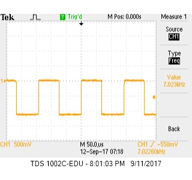
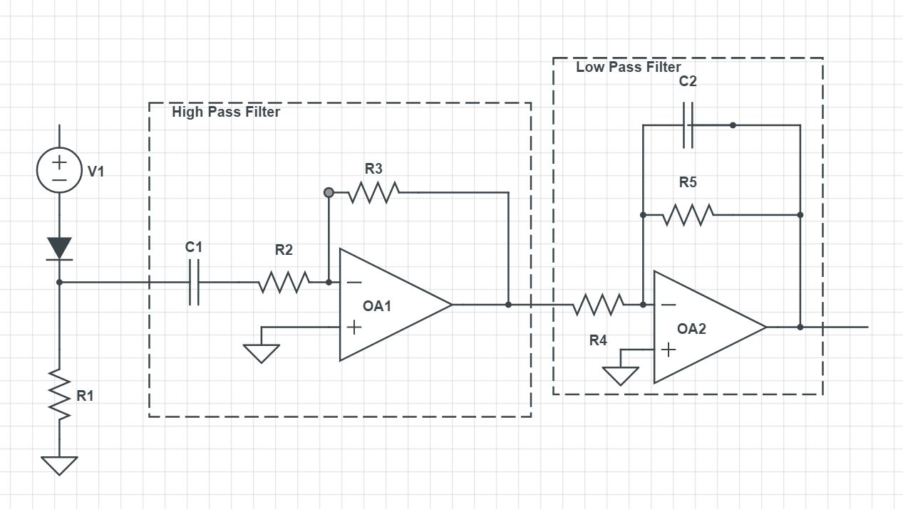
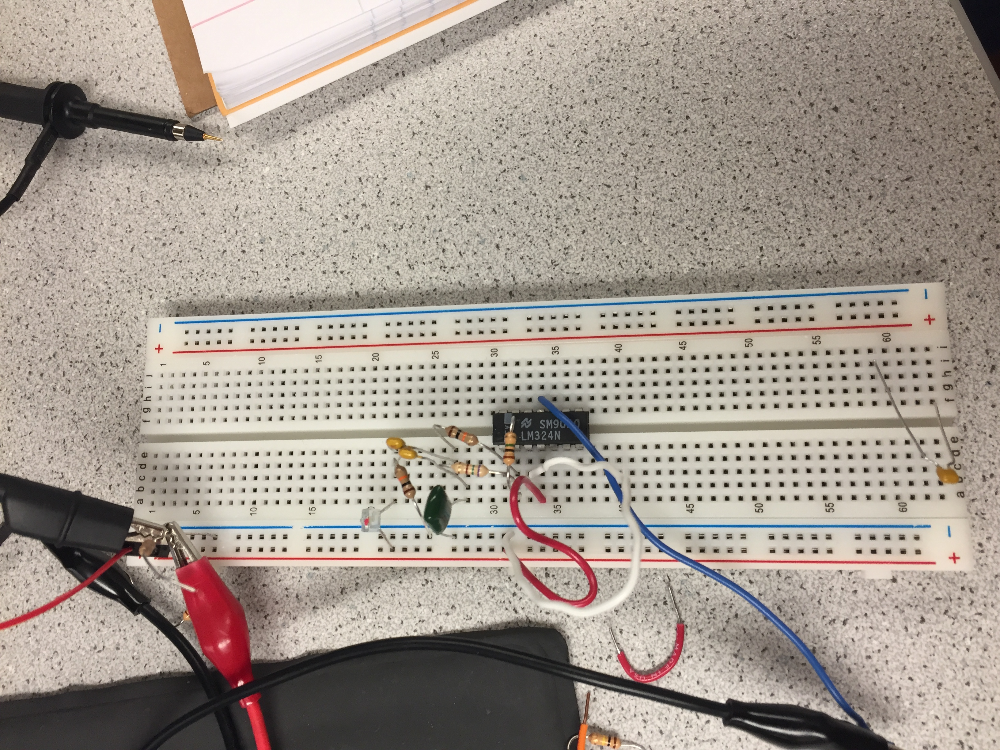
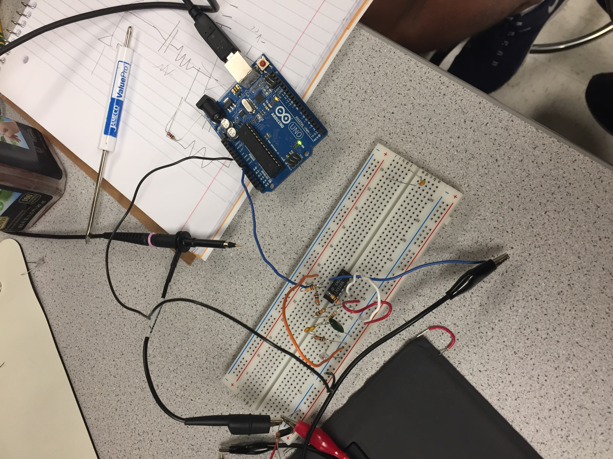

# __*Lab 2*__

### Objective
Our objective for this lab was to create two of the major sensors for our robots. The first sensor was a microphone circuit, which should be able to detect a 660Hz sound, which will eventually trigger the robot to begin its task. The other sensor is an optical circuit using a phototransistor, which should be able to detect a 7 kHz IR signal. The major key in this experiment was to be able to amplify and filter the circuits in such a way that the signals would be strong enough to be detected, and only the desired frequencies would be detected.

### Work Distribution
Since this lab was split into two major parts, we split into two teams. The acoustic team consisted of Adam, Kelsey, and David, while the optical team consisted of Rajiv, Aaron, and Christina.

### Lab Documentation

#### Materials
We found the materials needed for this lab
*
*
*
* Breadboard
* Resistors
* Wires
* Capacitors
* LM324N OpAmp
* Multimeter
* Oscilloscope
* Power Supply
* Arduino Uno
* Phototransistor
* Treasure Board

### Optical Team

#### Designing the filters
We began by reading the the signal from the treasure board onto the oscilloscope, to get a sense of what the signal be need to be detecting is. We adjusted the treasure's frequency oscilloscope's sensitivity and range until we got the reading shown below:

We noticed that the treasure had to be held very close to the phototransistor to get even a weak signal, so we decided that we would need to amplify the signal by using an OpAmp. In order to cut out all of the noise from the lights in the room, we needed to design a filter which would only be able to detect the signal from the treasure. After messing around with different ideas for bandpass filters, we decided that the best plan of action would be to create two filters, a high pass filter and a low pass filter. Using a computer aid and schematic (pictured below), we connected a high pass filter to our input signal and a low pass filter to our output signal (after the amplification).

We connected various different resistor combinations and voltages until we found a gain that we would be able to use the AnalogRead on the Arduino with. Finally, we were left with a circuit that looked like this:

After seeing that we could get a decent-looking reading out from the oscilloscope with this circuit when the IR treasure was shined on it, we hooked it up to the Arduino. 

After writing some code, shown below, we were able to read out the intensity of our signal to the computer:

(CODE HERE)

[Here's a video of the light intensity values read out by the Arduino as the distance is varied](https://www.youtube.com/watch?v=5Cgi-F-WJ3k)

By using this information, we found that the threshold we would need to impose on the readings should be 20, because there is some IR light in the room not from the treasure. Once this was done, we could confidently say that once the reading surpassed 20, then the IR light being detected must be coming from the treasure. To demonstrate this, we wrote some code and hooked up an LED such that when the IR treasure has been detected, we LED will light up.

(CODE HERE)

[See it in action here!](https://www.youtube.com/watch?v=T8tgYlkvlMY)

### Results and Conclusion

Upon completion of the lab, the optical team was able to successfully create a circuit which can detect an IR signal of 7 kHz, and distinguish it from light in the room.

### Acoustic Team

#### Testing the Microphone and FFT_ADC_Serial sketch

We started off by seeing the kind of output the microphone had by hooking it up to the oscilloscope. Initially, it had a relatively small output. To address this problem we approached it two different ways. We created an non-inverting amplifier and  we also tried using the small circuitry attached to the microphone itself. 

The microphone's own adujustable gain proved to be enough to get a large output for reading the frequency. We were able to adjust that gain by raising the pot on the back of the microphone to max. 
[Microphone product on Adafruit. contains details and datasheet](https://www.adafruit.com/product/1063)
(insert picture of the us reading the 660 Hz frequency with just microphone 5V pk-pk) 

Additionally, here is a picture of our microphone circuit:

Next, we studied the ADC of the arduino, the FFT library and the fft_adc_serial sketch. With a bit of research on the [Atmega328 Data sheet](http://www.atmel.com/Images/Atmel-42735-8-bit-AVR-Microcontroller-ATmega328-328P_Datasheet.pdf), we were able to gather some useful info on the ADC starting on page 305. Some of the most important specs are
* It has 10-bit Resolution
* The ADC clock is dependent on the chosen prescaler which is set based on the last 3 bits of the ADCSRA register
* The default prescaler is 128 which maps to a clock of 125 kHz. A prescaler of 64 maps to 25 kHz and then so on and so forth accordingly 
* The arduino requires an input clock frequency between 50kHz and 200kHz to get maximum resolution
* A normal conversion takes 13 ADC clock cycles
* The sampling frequency is the clock rate divided by the amount of cycles, Fs=Clock rate/cycles.(Fs=125000/13=9615Hz) 
* The output is stored in ADCL and ADCH registers
* The ADC can be run in a variety of ways, we chose to use the ADC's free running mode

Using this information, we were able to build off of code previously provided in the API, and plot the fourier transforms of the signals we picked up with the microphone. We began by running the sample script, fft_adc_serial, with an output from the function generator. We captured the transform data of many waveforms at various frequencies, and compared the outputs on a single excel graph.

