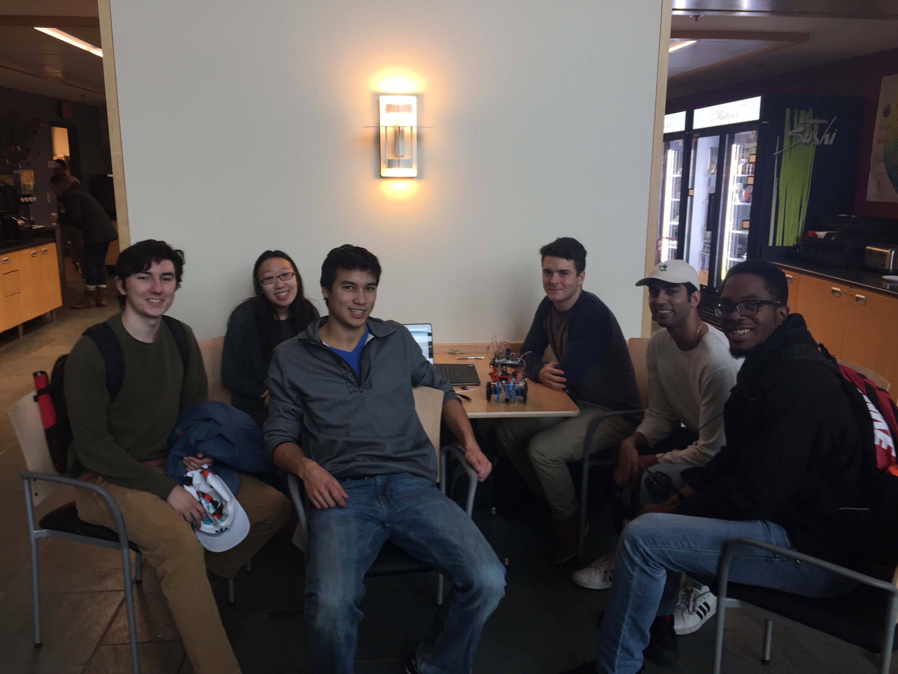

*From left to right: David Valley (drv34), Christina Xu (chx3), Aaron Wisner (daw286), Adam Macioszek (amm452), Rajiv Kommareddy (rrk64), and Kelsey Nedd (kan54).*

### Click [here](https://www.youtube.com/channel/UCm90IIF1_Y7RqOT-j5PvCxw/f) to go to our YouTube channel! You can click on our playlists to see how the robot progressed over the course of the semester, including bonus [behind-the-scenes footage](https://www.youtube.com/watch?v=dQw4w9WgXcQ) of the building process!

## Final Design
* [Final Discussion of Robot (includes cost)](FinalRobotDesignAndComments.md)

## Labs
* [Lab 1](Lab1page.md)
* [Lab 2](Lab2Page.md)
* [Lab 3](Lab3Page.md)
* [Lab 4](Lab4Page.md)

## Milestones
* [Milestone 1](Milestone1Page.md)
* [Milestone 2](Milestone2Page.md)
* [Milestone 3](Milestone3Page.md)
* [Milestone 4](Milestone4Page.md)

## Miscellaneous
* [Team Contract](Contract2.0.pdf)
* [Meeting Minutes (last updated 12/1/17)](Minutes.pdf)
* [Ethics Homework](Ethics.pdf)

## PUBLIC SHAME LIST
* Nobody -- nice work everybody!
